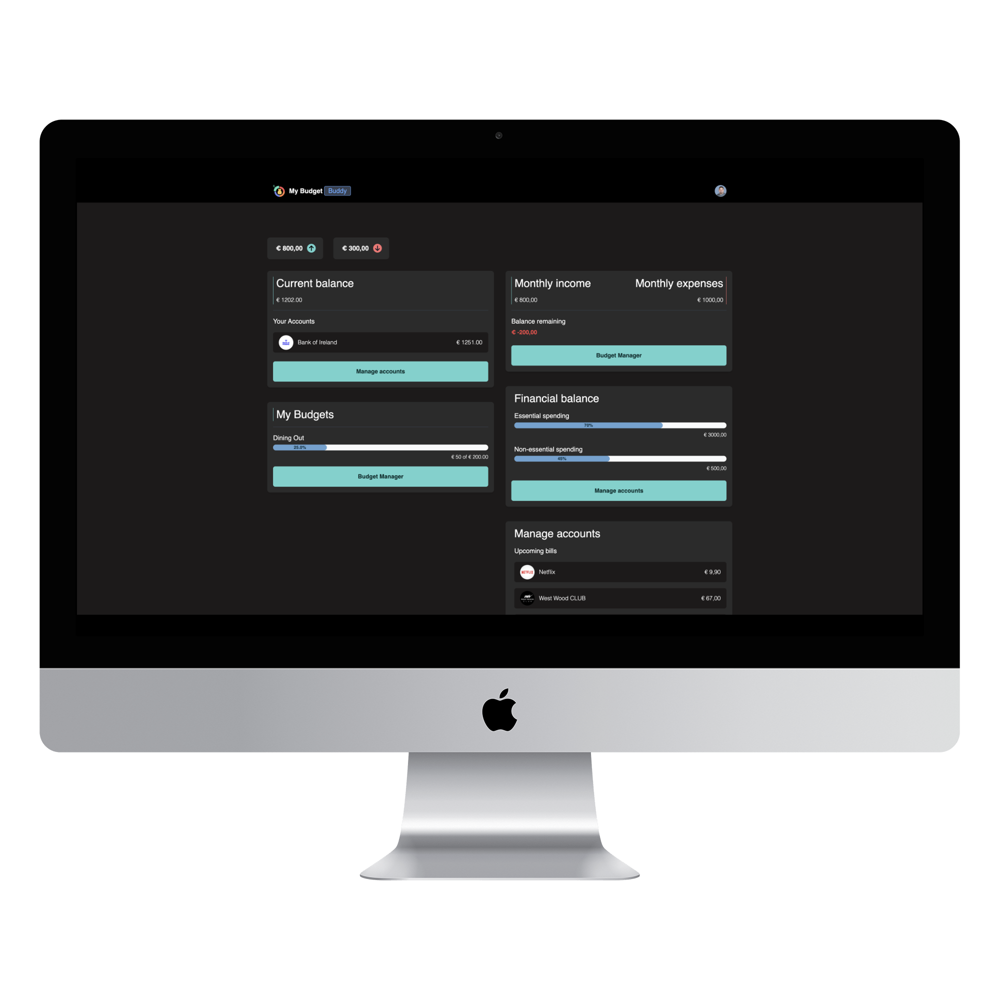
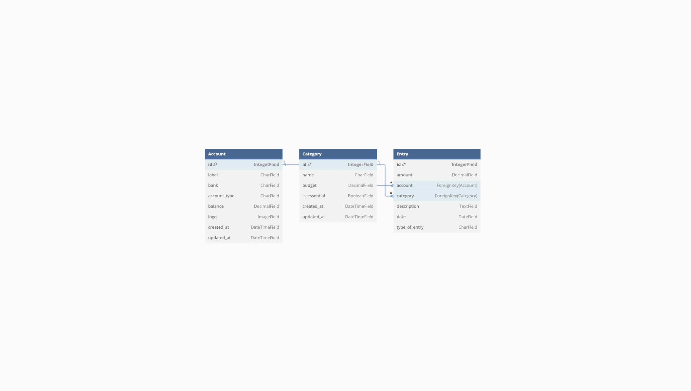

# **My Budget Buddy**

<div align="center">
  
</div>

<div align="center">


</div>

# Table of Contents

- [**My Budget Buddy**](#my-budget-buddy)
- [Table of Contents](#table-of-contents)
- [Briefing](#briefing)
- [Features](#features)
  - [Data Storage](#data-storage)
    - [Database schema](#database-schema)
    - [Account Table](#account-table)
    - [Category Table](#category-table)
    - [Entry Table](#entry-table)
- [Technologies Used](#technologies-used)
  - [Languages](#languages)
  - [Frameworks](#frameworks)
  - [Libraries](#libraries)
- [Deployment](#deployment)
  - [Forking the GitHub Repository and Running this Project Locally](#forking-the-github-repository-and-running-this-project-locally)
    - [Creating a new virtual environment](#creating-a-new-virtual-environment)
    - [Activating a virtualenv](#activating-a-virtualenv)
- [Author](#author)

# Briefing

**My Budget Buddy** is a personal finance management tool designed to help you track your expenses and income effortlessly. Whether you're managing daily spending, budgeting for future expenses, or simply wanting to get a better grip on your finances, ExpenseEase offers an intuitive and straightforward solution.

# Features

- **Income and Expense Tracking:** Log and categorize your income and expenses with ease.
- **Custom Categories:** Add your own categories to suit your unique financial habits.
- **Visual Insights:** Get an overview of your financial health with easy-to-understand charts and summaries.
- **Multi-Account Support:** Manage multiple accounts, whether they are bank accounts, credit cards, or wallets.
- **Date-Specific Entries:** Keep track of your financial entries with date-specific logs.
- **Expense vs. Income:** Easily distinguish between your expenses and income with a clear, user-friendly interface.
- **Essential vs. Non-Essential Expenses:** Identify essential spending and find areas where you can save.
- **Responsive Design:** Enjoy a seamless experience across all devices, from desktop to mobile.

## Data Storage

### Database schema

<div align="center">

</div>


### Account Table

| Title        | Key In Database | Form Validation                            | Data Type     |
| ------------ | --------------- | ------------------------------------------ | ------------- |
| id           | id              | No Validation                              | Primary Key   |
| Label        | label           | max_length 50                              | CharField     |
| Bank         | bank            | max_length 4 choices=BANK_CHOICES          | CharField     |
| Account Type | account_type    | max_length=2, choices=ACCOUNT_TYPE_CHOICES | CharField     |
| Balance      | balance         | max_digits=10, decimal_places=2, default=0 | DecimalField  |
| Logo         | logo            | No Validation                              | ImageField    |
| Created at   | created_at      | auto_now_add=True                          | DateTimeField |
| Updated at   | updated_at      | auto_now=True                              | DateTimeField |


```
BANK_CHOICES = (
    ("AIB", "Allied Irish Banks"),
    ("BOI", "Bank of Ireland"),
    ("PTSB", "Permanent TSB"),
    ("ANP", "An Post Money"),
    ("REV", "Revolut"),
    ("N26", "N26"),
    ("CU", "Credit Union"),
    ("OTH", "Other")
)
```

```
ACCOUNT_TYPE_CHOICES = (
    ("PA", "Personal Account"),
    ("BE", "Business Entity")
)
```

### Category Table

| Title        | Key In Database | Form Validation                            | Data Type     |
| ------------ | --------------- | ------------------------------------------ | ------------- |
| Id           | id              | No Validation                              | Primary Key   |
| Name         | name            | max length 50                              | CharField     |
| Budget       | budget          | max_digits=10, decimal_places=2, default=0 | DecimalField  |
| Is Essential | is_essential    | default='False'                            | BooleanField  |
| Created at   | created_at      | auto_now_add=True                          | DateTimeField |
| Updated at   | updated_at      | auto_now=True                              | DateTimeField |


### Entry Table

| Title         | Key In Database | Form Validation                            | Data Type     |
| ------------- | --------------- | ------------------------------------------ | ------------- |
| Id            | id              | No Validation                              | Primary Key   |
| Amount        | amount          | max_digits=10, decimal_places=2, default=0 | DecimalField  |
| Category      | category        | Category, on_delete=models.DO_NOTHING      | Foreign Key   |
| Description   | description     | No Validation                              | TextField     |
| Date          | date            | auto_now=False, auto_now_add=False         | DateTimeField |
| Account       | account         | Account, on_delete=models.DO_NOTHING       | Foreign Key   |
| Type of Entry | type_of_entry   | choices=ENTRIES_CHOICES, max_length=2      | CharField     |


```
ENTRIES_CHOICES = (
    ("IN", "Income"),
    ("EX", ("Expense"))
)
```

[Back to top ⇧](#table-of-contents)


# Technologies Used

## Languages

1. **HTML5, or Hyper Text Markup Language:** Used to construct the page within this app -   
https://developer.mozilla.org/en-US/docs/Web/HTML

1. **Javascript:** Used to create iterations across the page. - https://www.javascript.com/

2. **Python:** Used to develop all application logic. (https://www.python.org/)

## Frameworks

- [Django](https://www.djangoproject.com/)
- [Tailwind CSS](https://tailwindcss.com)

## Libraries

- [Flowbite](https://flowbite.com)

# Deployment

## Forking the GitHub Repository and Running this Project Locally

By forking the GitHub Repository we make a copy of the original repository on our GitHub account to view and/or make changes without affecting the original 
repository by using the following steps...

1. Log in to GitHub and locate the [GitHub Repository](https://github.com/)

2. In the Repository header (not at the top of the page), find a "Code" drop-down button. By clicking this button, you will find some options to clone the project repository. If you have your SSH key configured, choose to select the 'SSH' option and then click on the button right after the url. This button will copy the url and you will paste it in your terminal. If you have not configured your SSH key, you can choose to use the HTTPS protocol. In the same way as was done in the SSH option, when selecting 'HTTPS' you must click on the button right after the url to copy and then paste it into your terminal.

```https://github.com/emidiovaleretto/my-budget-buddy.git```

1. You should now have a copy of the original repository in your GitHub account.

2. Ideally you will want to work within a virtual environment to allow all packages to be kept within the project, this can be installed using the following command (please note some IDE's require pip3 instead of pip, please check with the documentation for your chosen IDE). To create a virtual environment, run the command

### Creating a new virtual environment

The process of creating a virtualenv is quite simple and can be done using a single command, as seen below:

```python3 -m venv <your_virtual_environment_name>```

*Hint: I usually choose to name my virtual environments after the project name, rather than just writing 'venv', for example, the project is called `MyBlogProject`, so the name of the virtual environment would be something like `myblogenv`. If you need to return to a certain project after a while, you'll easily find the respective environment for that project. But that is totally up to you.*

### Activating a virtualenv

After creating a virtualenv, it's needed to activate it so that you can install the necessary packages for the project. To do this, run the following command:

`source your_virtual_environment_name/bin/activate (Linux ou macOS)`

`your_virtual_environment_name/Scripts/Activate (Windows)`

1. Once that's done, you need to install the project's dependencies. To do this, just run the following command:

pip3 install -r requirements.txt

2. Next you need to create a new file within the root directory called `.env`. This file will contain all your secret keys, public keys, production database settings etc. Everything you think should not be exposed, you should put within this file. 

So add the following lines to configure the environmental variables.

```

SECRET_KEY=YOUR_DJANGO_SECRET_KEY

```

*Note that, at this stage, the value of `SECRET_KEY` must be without quotes.


# Author

Made with ❤️ by <b>Emidio Valereto</b>  Get in touch!

[](https://www.linkedin.com/in/emidiovalereto/) [](mailto:emidio.valereto@gmail.com)

[Back to top ⇧](#table-of-contents)
